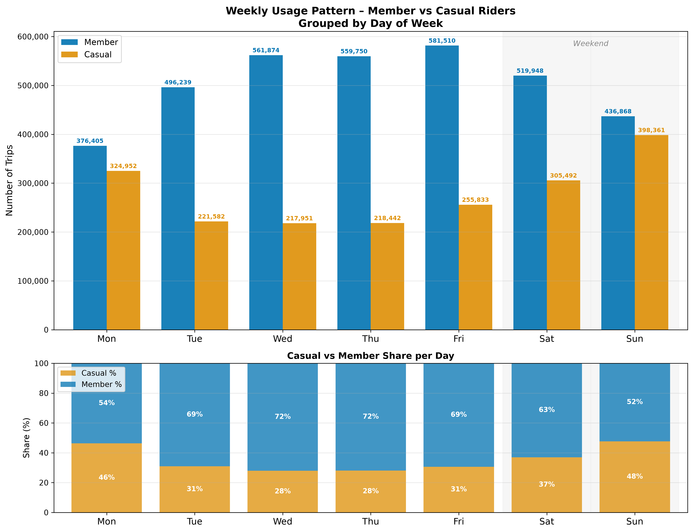
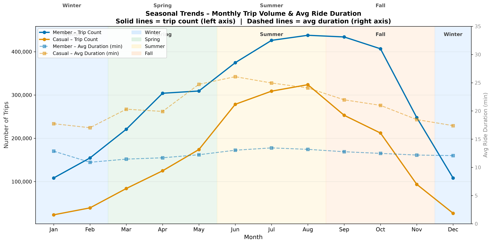
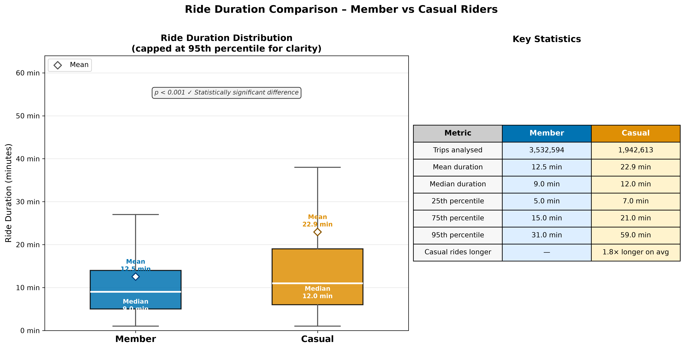
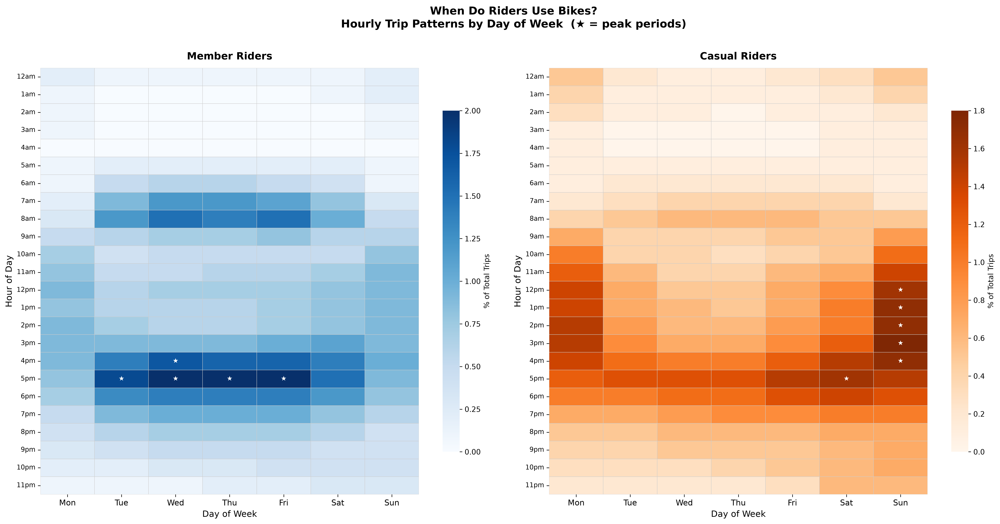
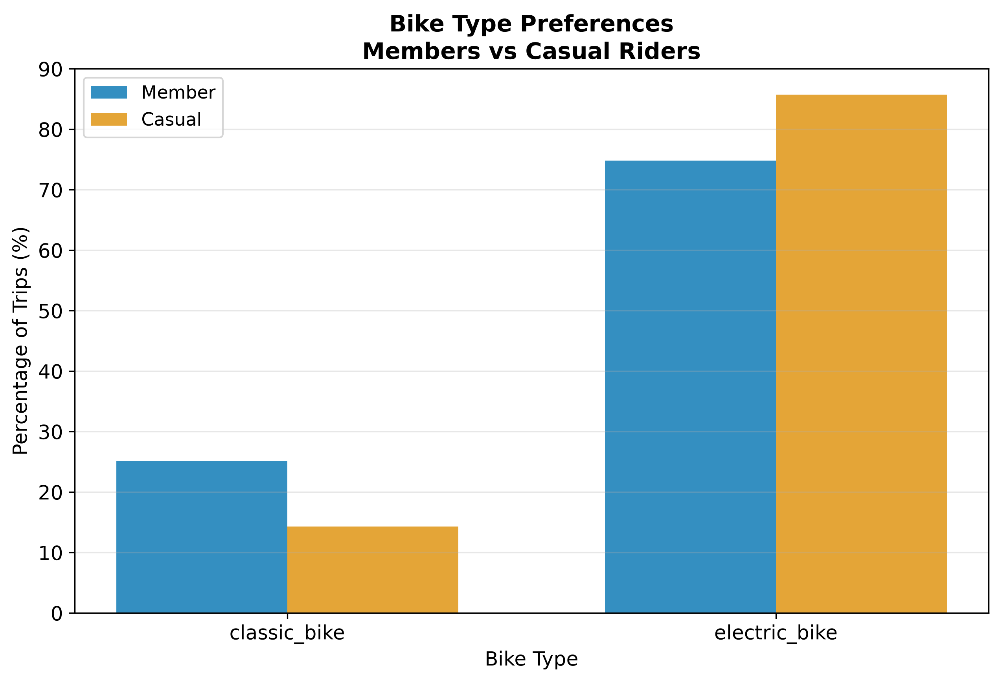
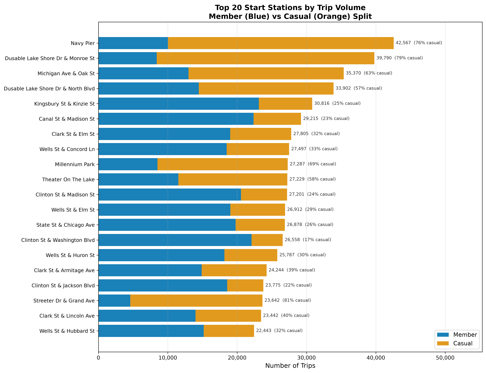

# Cyclistic Bike-Share Analysis
### Google Data Analytics Capstone Project


<p align="center">
  
  
</p>

---

## Table of Contents

- [Project Overview](#project-overview)
- [Business Task](#business-task)
- [Data Source](#data-source)
- [Tools and Technologies](#tools-and-technologies)
- [Project Workflow](#project-workflow)
- [Key Findings](#key-findings)
- [Visualisations](#visualisations)
- [Recommendations](#recommendations)
- [KPI Framework](#kpi-framework)
- [Implementation Roadmap](#implementation-roadmap)
- [Repository Structure](#repository-structure)
- [How to Run](#how-to-run)
- [Acknowledgements](#acknowledgements)

---

## Project Overview

This project is a full end-to-end data analytics case study completed as the capstone for the **Google Data Analytics Professional Certificate**. It analyses 12 months of real-world bike-share trip data from **Cyclistic** (based on Divvy, Chicago) to uncover behavioural differences between annual members and casual riders, and to produce data-backed marketing recommendations that drive casual-to-member conversion.

| Metric | Value |
|---|---|
| Total Trips Analysed | 5,475,207 |
| Time Period | May 2025 - April 2026 |
| Member Trips | 3,532,594 (64.5%) |
| Casual Trips | 1,942,613 (35.5%) |
| Unique Start Stations | 1,809 |
| Python Tests Passing | 82 / 82 |
| Visualisations Produced | 6 (300 DPI) |
| Analysis Phases | 6 |

---

## Business Task

> **How do annual members and casual riders use Cyclistic bikes differently, and how can those differences inform a targeted marketing strategy to convert casual riders into annual members?**

Cyclistic's finance team has determined that annual members are significantly more profitable than casual riders. The director of marketing believes the path to future growth lies in maximising the number of annual memberships. This analysis provides the data foundation for that strategy.

---

## Data Source

- **Provider**: Motivate International Inc. / Divvy Bikes (Chicago)
- **Format**: 12 monthly CSV files (May 2025 - April 2026)
- **Licence**: [Divvy Data Licence Agreement](https://divvybikes.com/data-license-agreement) - public, non-commercial use
- **Privacy**: No personally identifiable information (PII) is present. Rider-level data is anonymised.

**Known data quality issues handled in Phase 3:**
- ~21% of station names missing (rows retained - station name not required for core analysis)
- 239 duplicate `ride_id` values removed
- 97,172 zero-duration rides removed
- 29 negative-duration rides removed
- 5,857 rows with missing end coordinates retained (coordinates not required for duration/day analysis)

---

## Tools and Technologies

| Tool | Purpose |
|---|---|
| Python 3.11 | Core analysis language |
| pandas | Data loading, cleaning, transformation |
| matplotlib and seaborn | All 6 visualisations (300 DPI) |
| scipy | Statistical testing (t-test, chi-square) |
| numpy | Vectorised calculations (Haversine distance) |
| pytest | Test-driven development - 82 tests across 5 suites |
| HTML / CSS | Phase reports, pivot tables, presentation deck |

---

## Project Workflow

<details>
<summary><strong>Phase 1 - Ask</strong></summary>

**Objective**: Define the business task and identify key stakeholders.

- Identified the core question: how do members and casual riders differ in their usage?
- Defined success metrics: conversion rate, ride frequency, seasonal patterns
- Stakeholders: Director of Marketing, Cyclistic Executive Team, Marketing Analytics Team
- Output: `Phase_1_Business_Understanding.html`

</details>

<details>
<summary><strong>Phase 2 - Prepare</strong></summary>

**Objective**: Load, validate and standardise 12 months of raw CSV data.

- Discovered and loaded 12 CSV files (5.4M+ rows)
- Parsed mixed datetime formats (`dd/mm/yyyy hh:mm am/pm` and 24-hour)
- Derived columns: `ride_length_minutes`, `day_of_week`, `hour_of_day`, `month`, `season`, `is_weekend`
- Validated schema, data types and completeness
- **Tests**: 7 passing
- **Outputs**: `phase2_data_summary.json`, `phase2_validation_metrics.json`, `combined_data_sample.csv`

</details>

<details>
<summary><strong>Phase 3 - Process</strong></summary>

**Objective**: Clean the dataset and engineer features for analysis.

- Removed duplicates, zero/negative-duration rides, and out-of-bounds coordinates
- Normalised station names (strip, title-case, null handling)
- Computed **Haversine distance** (km) between start and end coordinates
- Flagged **round trips** (same start/end station or coordinates within 50m)
- Validated cleaned dataset with completeness scoring
- **Tests**: 7 passing
- **Output**: `phase3_cleaned_data.csv` (5,475,207 rows, 1.15 GB), `phase3_cleaning_report.json`

</details>

<details>
<summary><strong>Phase 4 - Analyse</strong></summary>

**Objective**: Perform descriptive, comparative and statistical analysis.

- Computed ride duration statistics (mean, median, percentiles) by rider type
- Built 6 pivot tables: duration by day, volume by day, duration by hour, bike type mix, monthly trends, top 20 stations
- Ran 3 statistical tests:
  - **Two-sample t-test** on ride duration: t = -209.96, p < 0.001, Cohen's d = -0.19
  - **Chi-square** on day-of-week vs rider type: x2 = 144,895, p < 0.001
  - **Chi-square** on bike type vs rider type: x2 = 1,950.8, p < 0.001
- **Tests**: 19 passing
- **Outputs**: `phase4_analysis_results.json`, `Phase_4_Pivot_Tables.html`

</details>

<details>
<summary><strong>Phase 5 - Share</strong></summary>

**Objective**: Communicate findings through visualisations and a presentation deck.

- Generated 6 publication-quality charts (300 DPI PNG)
- Applied colorblind-friendly palette: Member = `#0173B2` (blue), Casual = `#DE8F05` (orange)
- All charts meet WCAG AA contrast standards and minimum 12pt font size
- Produced a 10-slide HTML executive presentation
- **Tests**: 26 passing
- **Outputs**: `viz_01` through `viz_06` PNGs, `Phase_5_Presentation.html`

</details>

<details>
<summary><strong>Phase 6 - Act</strong></summary>

**Objective**: Translate analysis into actionable business recommendations.

- Generated 3 data-backed recommendations with KPI targets
- Built a 6-metric KPI framework with targets, measurement frequency and data sources
- Produced a 5-phase, 12-month implementation roadmap
- Wrote executive summary with 5 key findings and 15% projected ROI
- **Tests**: 23 passing
- **Outputs**: `Phase_6_Portfolio_Case_Study.html`, `Phase_6_Final_Report.html`

</details>

---

## Key Findings

- **Casual riders ride 83% longer on average** - 22.9 min vs 12.5 min for members - indicating leisure-driven rather than commute-driven usage.

- **Members are weekday commuters; casuals are weekend explorers** - 77% of member trips fall on weekdays, while casual ridership spikes on Saturdays and Sundays (nearly 48% casual share on Sundays).

- **Peak hours tell two different stories** - Members peak sharply at 8am and 5pm (commute windows). Casuals peak between 12pm and 3pm and on weekend afternoons, consistent with recreational use.

- **Casual ridership is highly seasonal** - Summer accounts for 911,195 casual trips (47% of all casual trips), nearly 10x the Winter casual volume. Members ride consistently year-round (~500k trips/month).

- **Casual riders take 2.7x more round trips** - 8.4% of casual rides return to the start point vs 3.1% for members, confirming recreational rather than point-to-point commuting behaviour.

- **Both groups prefer electric bikes** - Casuals 66.6%, Members 64.7%. E-bike access is a viable membership conversion lever.

---

## Visualisations

### 1 - Ride Duration Comparison
<p align="center">
  
</p>

> Box plots (capped at 95th percentile) with a stats table. Casual riders consistently show higher duration across every percentile. The diamond marker shows the mean. p < 0.001 confirms the difference is statistically significant.

---

### 2 - Weekly Usage Pattern
<p align="center">
  
</p>

> Top panel: grouped bar chart showing absolute trip counts per day. Bottom panel: 100% stacked share showing what percentage of each day's trips came from each group. Weekend columns are shaded grey.

---

### 3 - Hourly Usage Heatmap
<p align="center">
  
</p>

> Side-by-side heatmaps (blue = Members, orange = Casuals). Values normalised to % of each group's total trips so both panels are directly comparable. Members show clear 8am/5pm commute spikes; casuals show midday and weekend afternoon peaks.

---

### 4 - Bike Type Preference
<p align="center">
  
</p>

> Grouped bar chart comparing electric vs classic bike usage. Both groups favour electric bikes, with casuals slightly higher at 66.6% vs 64.7% for members.

---

### 5 - Seasonal Trends
<p align="center">
  
</p>

> Monthly trip volume (solid lines, left axis) and average ride duration (dashed lines, right axis). Season bands colour-coded: blue = Winter, green = Spring, yellow = Summer, orange = Fall. Casual demand is highly seasonal; member demand is stable year-round.

---

### 6 - Top 20 Start Stations
<p align="center">
  
</p>

> Horizontal stacked bar chart ranking the top 20 stations by total trip volume. Blue = member trips, orange = casual trips. Total count and casual % labeled at the end of each bar. Navy Pier and Millennium Park are the highest-volume casual stations and prime targets for conversion campaigns.

---

## Recommendations

### REC-01 - Weekend Leisure-to-Membership Conversion Campaign
**Target**: Casual weekend riders  
**Action**: Launch a *Weekend Warrior* membership tier priced between single-ride and annual plans. Promote at high-traffic leisure stations (Navy Pier, Millennium Park, Streeter Dr) on Saturdays and Sundays via in-app banners and dock-side QR codes.  
**Channels**: In-app notifications, dock-side signage, social media  
**KPI Target**: 500 new weekend memberships per month in Q1 campaign

---

### REC-02 - Summer Peak Season Membership Drive
**Target**: High-frequency summer casual riders  
**Action**: Run a time-limited *Summer Membership* promotion June-August offering a discounted first-year annual membership with a free month for sign-ups during peak season.  
**Channels**: Email retargeting, push notifications, partner tourism apps  
**KPI Target**: 20% year-over-year increase in summer membership conversions

---

### REC-03 - Electric Bike Upgrade Incentive
**Target**: Casual riders with 3+ electric bike rides in a month  
**Action**: Offer a targeted *E-Bike Member* upgrade granting priority e-bike access and a reduced annual membership rate, delivered via in-app message.  
**Channels**: In-app messaging, email, loyalty program notifications  
**KPI Target**: 8% conversion rate among targeted casual e-bike users within 90 days

---

## KPI Framework

| KPI | Description | Target | Frequency |
|---|---|---|---|
| Conversion Rate | % of casual riders converting to annual membership | 10% | Monthly |
| Casual Ride Frequency | Avg rides per month per casual rider | 6 rides/month | Monthly |
| Summer Membership Growth | YoY growth in memberships sold June-August | 20% | Quarterly |
| E-Bike Conversion Rate | Conversion rate of targeted casual e-bike users | 8% | Monthly |
| Weekend Membership Sign-ups | New weekend tier sign-ups per month | 500/month | Monthly |
| Avg Revenue per Casual Rider | Avg revenue per casual rider per month | $15 USD | Monthly |

---

## Implementation Roadmap

| Phase | Timeline | Activities | Owner | Success Metric |
|---|---|---|---|---|
| 1 | Month 1-2 | Finalise weekend tier pricing; build in-app targeting logic; set up tracking dashboards | Product and Engineering | Weekend tier live; dashboard operational |
| 2 | Month 3-4 | Launch Weekend Warrior campaign at top 20 stations; deploy QR signage; begin A/B testing | Marketing | 500+ weekend sign-ups in first 60 days |
| 3 | Month 5-7 | Activate Summer Membership Drive; launch e-bike upgrade offer; run email retargeting | Marketing and CRM | 20% YoY increase in summer conversions |
| 4 | Month 8-10 | Analyse campaign performance; optimise messaging; expand successful channels | Analytics and Marketing | Conversion rate >= 10% for targeted segments |
| 5 | Month 11-12 | Full-year KPI review; prepare next annual strategy; present ROI to executives | Analytics and Leadership | All 6 KPIs at or above target |

---

## Repository Structure

```
cyclistic-bike-share-analysis/
|
|-- analysis_output/                  # All generated outputs
|   |-- viz_01_duration_comparison.png
|   |-- viz_02_weekday_pattern.png
|   |-- viz_03_hourly_heatmap.png
|   |-- viz_04_bike_type.png
|   |-- viz_05_seasonal_trends.png
|   |-- viz_06_station_map.png
|   |-- phase3_cleaned_data_sample.csv
|   |-- phase3_cleaning_report.json
|   |-- phase4_analysis_results.json
|   |-- Phase_5_Presentation.html
|   |-- Phase_6_Portfolio_Case_Study.html
|   `-- Phase_6_Final_Report.html
|
|-- tests/                            # TDD test suites
|   |-- test_phase2_prepare.py        # 7 tests
|   |-- test_phase3_process.py        # 7 tests
|   |-- test_phase4_analyze.py        # 19 tests
|   |-- test_phase5_visualizations.py # 26 tests
|   `-- test_phase6_act.py            # 23 tests
|
|-- phase2_prepare.py                 # Data loading and preparation
|-- phase3_process.py                 # Data cleaning pipeline
|-- phase4_analyze.py                 # Analysis and statistical tests
|-- phase5_visualize.py               # Visualisation generation
|-- phase6_act.py                     # Recommendations and reporting
|
|-- Phase_1_Business_Understanding.html
|-- Phase_4_Pivot_Tables.html
|-- Phase_4_Completion_Report.html
|-- Phase_5_Completion_Report.html
|-- Comprehensive_Project_Roadmap.html
|
|-- requirements.txt
`-- README.md
```

---

## How to Run

**Prerequisites**: Python 3.11+, Git

```bash
# 1. Clone the repository
git clone https://github.com/<your-username>/cyclistic-bike-share-analysis.git
cd cyclistic-bike-share-analysis

# 2. Create and activate virtual environment
python -m venv .venv

# Windows
.venv\Scripts\activate

# macOS / Linux
source .venv/bin/activate

# 3. Install dependencies
pip install -r requirements.txt

# 4. Run the full test suite
pytest tests/ -v

# 5. Run each phase in order
python phase2_prepare.py
python phase3_process.py
python phase4_analyze.py
python phase5_visualize.py
python phase6_act.py
```

> **Note**: Phase 3 processes 1.15 GB of data and may take 10-15 minutes depending on your machine. Phases 4-6 run in under 2 minutes each.

---

## Acknowledgements

- **Google Data Analytics Professional Certificate** - for the capstone framework and analytical methodology
- **Motivate International Inc.** - for making the Divvy bike-share trip data publicly available
- **City of Chicago / Divvy Bikes** - for maintaining the open dataset under the [Divvy Data Licence Agreement](https://divvybikes.com/data-license-agreement)

---

<p align="center">
  <em>Built with Python 3.11 · 5,475,207 trips analysed · 82 tests passing · 6 phases complete</em>
</p>
